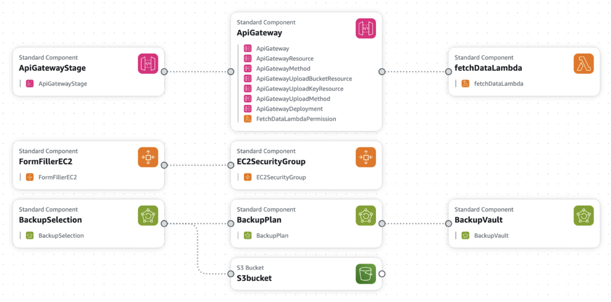


# Auto Form Filler

The Auto Form Filler system automates the task of completing an application form by utilizing backend services to retrieve and fill in form fields based on uploaded data. Users upload JPEG images containing relevant information, such as scanned documents. The frontend initiates the `fetchDetails()` function, sending a request to the backend API (`fetchDataLambda`) via API Gateway, including the image file name as input. The Lambda function (`fetchDataLambda`) processes the request, extracting data from the uploaded image stored in the specified S3 bucket (`khyatiscanneddocs`) using the Optical Character Recognition (OCR) tool AWS Textract. Extracted information, such as first name, last name, date of birth, and address, is then dynamically populated into corresponding form fields on the frontend interface. Users can review and confirm the prepopulated details before submitting the form.

By automating the form-filling process, the system aims to streamline and expedite the application process, reducing manual effort and potential errors. The frontend interface provides a user-friendly experience for uploading documents and reviewing prepopulated information, enhancing usability and accessibility for end-users. Overall, the system serves as an application form automation tool, improving efficiency, user experience, and data accuracy.

## Compute Resources
### AWS EC2:
- **Reason for Selection**: EC2 provides control over the virtual machine environment, which is essential for cases requiring more infrastructure control.
- **Comparison**: Compared to Elastic Beanstalk, which automates deployment, load balancing, and scaling, EC2 offers more flexibility.
- **Containerized Alternatives**: Docker with Elastic Beanstalk and AWS ECS/ECR are suitable for containerized applications, but EC2 provides deeper customization for specific use cases.

### AWS Lambda:
- **Serverless Computing**: AWS Lambda eliminates the need for provisioning or managing servers.
- **Automatic Management**: Lambda functions execute automatically, managing scaling and availability, without requiring server maintenance.

## Storage
### AWS S3:
- **Document Storage**: Selected for storing various document types (e.g., PNG, JPG, PDF).
- **Features**:
  - **Scalability**: S3 handles growing data volume seamlessly.
  - **Durability**: Provides 11 nines of durability and high availability.
  - **Cost-Effectiveness**: Pricing model based on data stored, data transfer, and requests, allowing cost optimization.

## Network
### API Gateway:
- **Managed Service**: API Gateway simplifies API request routing to backend services, managing security, scaling, and availability.
- **Security and Cost Efficiency**: Offers built-in security, pay-as-you-go pricing, and seamless integration with AWS Lambda.

## Additional AWS Services
1. **AWS Textract**: Extracts text and data from scanned documents to prepopulate form fields, enhancing data entry efficiency.
2. **AWS Backup**: Ensures data protection by providing a backup and recovery layer.

## Deployment Model
### Public Cloud
- **Benefits**:
  - **Scalability and Flexibility**: AWS allows seamless scaling in response to demand changes.
  - **Cost Efficiency**: Pay-as-you-go pricing eliminates upfront costs.
  - **Reliability**: AWS infrastructure supports high reliability and security.

### Delivery Model: Function-as-a-Service (FaaS)
- **AWS Lambda**: Facilitates serverless computing, enabling cost-effective, on-demand function execution without server management.

## Security
- **Data in Transit**: Secured through API Gateway and Lambda integration within the AWS network.
- **Data at Rest**:
  - **Encryption**: Server-side encryption in S3 ensures data security.
  - **Access Control**: IAM policies and S3 bucket policies limit unauthorized access.

## Architecture Overview

- **Frontend**: Hosted on an EC2 instance with a user-friendly interface.
- **Backend**:
  - **Lambda Functions**: Process data and manage business logic.
  - **API Gateway**: Exposes Lambda functions as HTTP endpoints.
  - **S3 Bucket**: Stores uploaded images for processing.

### Programming Languages
- **Backend**: Python (3.12) used for AWS Lambda functions.
- **Frontend**: HTML, CSS, and JavaScript.

### Deployment and Monitoring
- **Infrastructure as Code**: CloudFormation script automates the setup of resources.
- **Monitoring**: AWS Lambda is monitored for cost management, tracking invocation count, duration, and memory usage.

## Future Work
- **Enhanced Image Processing**: Implement advanced techniques for improved data extraction.
- **User Authentication**: Add authentication and authorization with AWS Cognito.

---

**Author**: Khyati Parmar 
